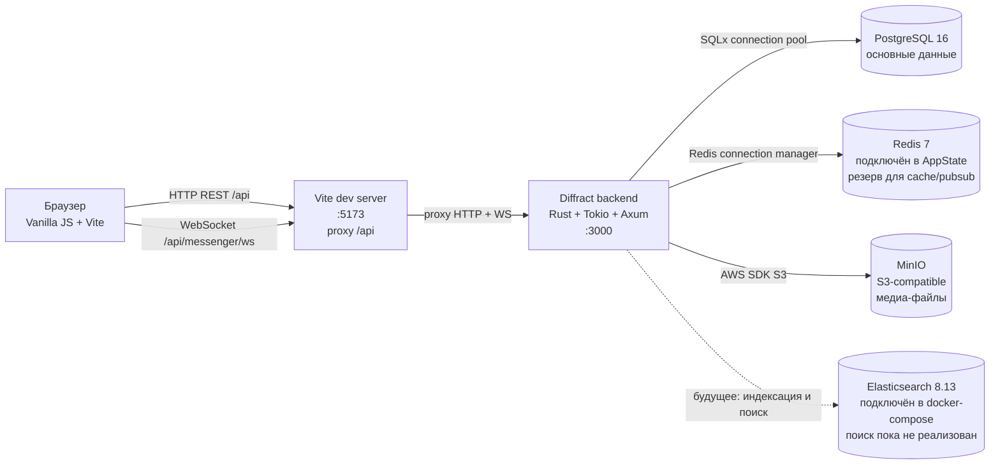
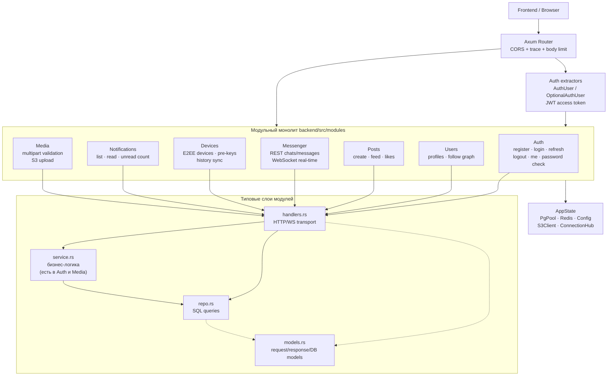
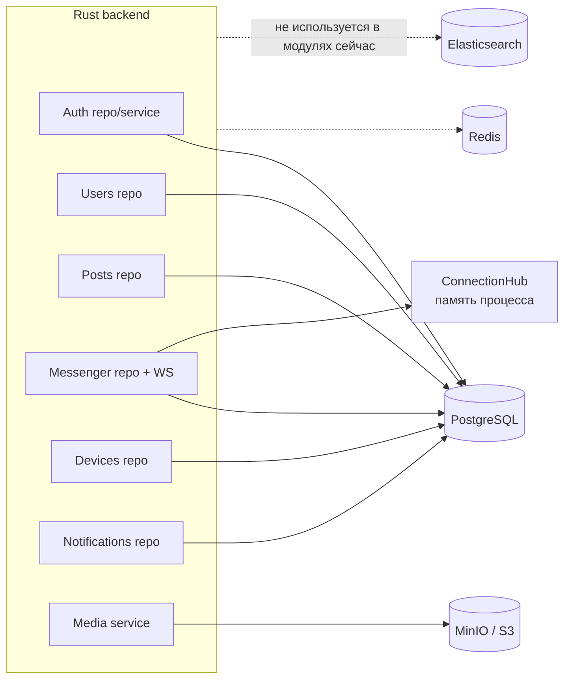
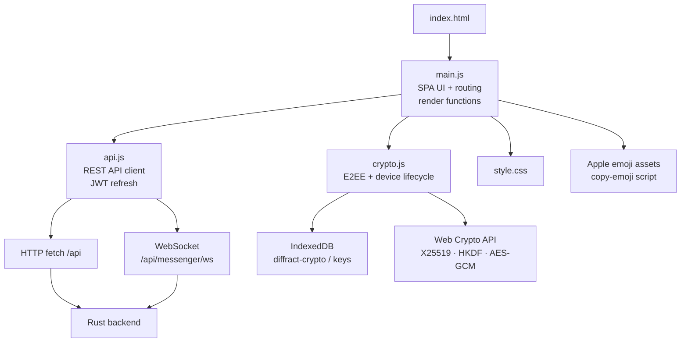
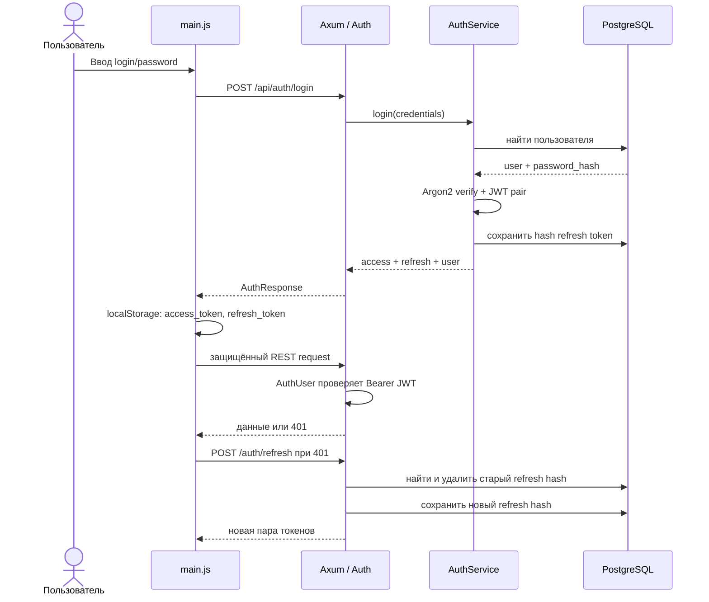
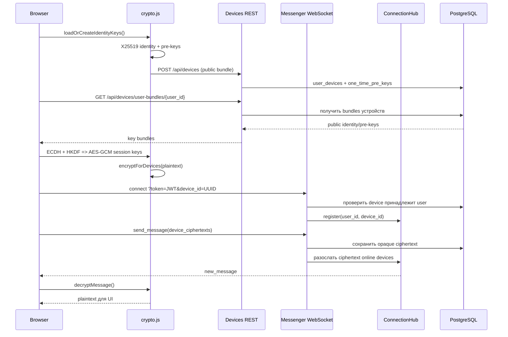
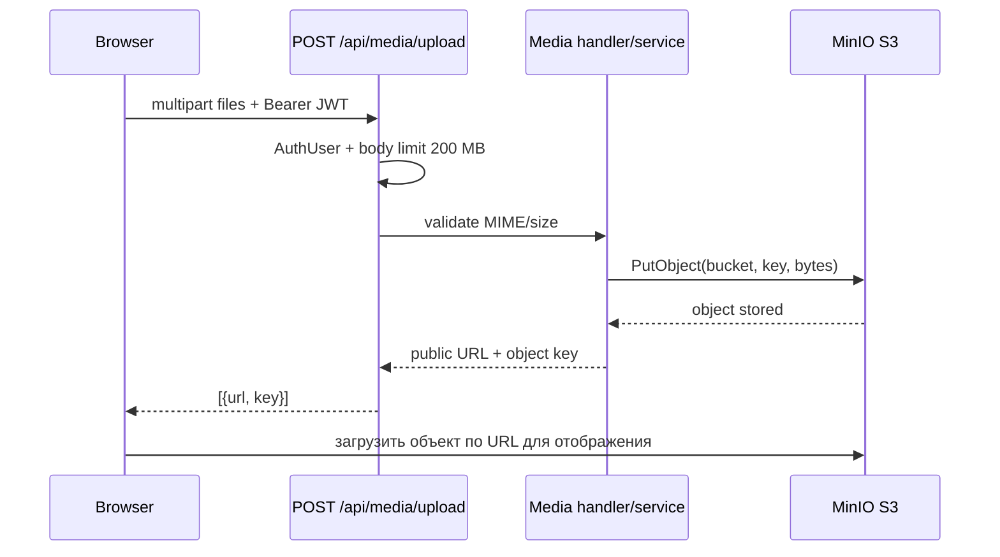

# Diffract — UML-диаграммы архитектуры

Документ описывает фактическую архитектуру проекта по состоянию на текущую ревизию. Диаграммы написаны в Mermaid и отображаются в GitHub, GitLab, Obsidian и редакторах с поддержкой Mermaid.

## 1. Общая архитектура и развёртывание



Локальные порты: frontend `5173`, backend `3000`, PostgreSQL `5432`, Redis `6379`, MinIO API `9000`, MinIO console `9001`, Elasticsearch `9200`.

## 2. Backend: компонентная UML-диаграмма



Все модули собираются в один бинарник и получают общее состояние через Axum `State<AppState>`. Границы модулей сейчас организационные, а не сетевые: отдельные процессы/микросервисы не создаются.

## 3. Backend: маршруты и модули

```mermaid
classDiagram
    class AppState {
      +PgPool db
      +RedisConnectionManager redis
      +Config config
      +S3Client s3_client
      +ConnectionHub hub
    }

    class Router {
      +/api/auth
      +/api/devices
      +/api/users
      +/api/posts
      +/api/messenger
      +/api/notifications
      +/api/media
    }

    class AuthModule {
      +POST /register
      +POST /login
      +POST /refresh
      +POST /logout
      +GET /me
      +POST /verify-password
    }
    class UsersModule {
      +GET /{username}
      +PATCH /profile
      +POST|DELETE /{username}/follow
      +GET /followers|following
    }
    class PostsModule {
      +POST /
      +GET /feed
      +GET|DELETE /{id}
      +POST|DELETE /{id}/like
    }
    class MessengerModule {
      +GET /ws
      +POST|GET /chats
      +GET /chats/{id}/messages
    }
    class DevicesModule {
      +POST|GET /
      +POST /{id}/approve
      +DELETE /{id}
      +POST /{id}/pre-keys
      +GET /user-bundles/{user_id}
      +POST|GET|DELETE /history-sync
    }
    class NotificationsModule {
      +GET /
      +GET /unread-count
      +PATCH /read-all
      +PATCH /{id}/read
    }
    class MediaModule {
      +POST /upload
    }

    Router --> AppState
    Router --> AuthModule
    Router --> UsersModule
    Router --> PostsModule
    Router --> MessengerModule
    Router --> DevicesModule
    Router --> NotificationsModule
    Router --> MediaModule
```

## 4. Backend: зависимости от внешних хранилищ



`PostgreSQL` — единственное хранилище, реально используемое бизнес-модулями в SQL-запросах. `ConnectionHub` хранит активные WS-соединения только в памяти процесса, поэтому состояние online/маршрутизация не являются распределёнными при запуске нескольких экземпляров backend. Redis присутствует в `AppState`, но активная логика модулей его не использует. Elasticsearch присутствует в конфигурации и Docker Compose, но поисковые endpoints и индексация не написаны.

## 5. Frontend: компонентная UML-диаграмма



Фронтенд — одностраничное приложение без отдельного UI-фреймворка. `main.js` совмещает навигацию, состояние приложения и рендеринг экранов. `api.js` централизует REST-вызовы и автоматический refresh JWT. `crypto.js` хранит приватные ключи и сессионные ключи в IndexedDB браузера.

## 6. Сценарий аутентификации



## 7. Сценарий чата и E2EE



Сервер не должен расшифровывать содержимое сообщений: в БД хранятся `encrypted_content`/`nonce` и отдельные ciphertext для устройств. При этом текущая реализация передаёт JWT WebSocket через query parameter — это отмечено в `ARCHITECTURE.md` как технический долг.

## 8. Сценарий загрузки медиа



Bucket создаётся при старте backend, а `MediaService` выставляет public-read policy. URL медиа возвращается клиенту; сами ссылки не сохраняются автоматически в пост — интеграция медиа с постами пока неполная.

## 9. Данные PostgreSQL

```mermaid
erDiagram
    USERS ||--o{ FOLLOWS : follower
    USERS ||--o{ FOLLOWS : following
    USERS ||--o{ POSTS : authors
    USERS ||--o{ POST_LIKES : likes
    POSTS ||--o{ POST_LIKES : receives
    CHATS ||--o{ CHAT_MEMBERS : contains
    USERS ||--o{ CHAT_MEMBERS : joins
    CHATS ||--o{ MESSAGES : contains
    USERS ||--o{ MESSAGES : sends
    USERS ||--o{ USER_DEVICES : owns
    USER_DEVICES ||--o{ ONE_TIME_PRE_KEYS : provides
    MESSAGES ||--o{ MESSAGE_DEVICE_CIPHERTEXTS : encrypted_for
    USER_DEVICES ||--o{ MESSAGE_DEVICE_CIPHERTEXTS : receives
    USERS ||--o{ NOTIFICATIONS : receives
    USERS ||--o{ REFRESH_TOKENS : authenticates
    USER_DEVICES ||--o{ HISTORY_SYNC_PACKAGES : sender
    USER_DEVICES ||--o{ HISTORY_SYNC_PACKAGES : recipient

    USERS { uuid id PK; string username UK; string email UK; string password_hash }
    FOLLOWS { uuid follower_id PK; uuid following_id PK }
    POSTS { uuid id PK; uuid author_id FK; text content; text_array media_urls }
    POST_LIKES { uuid user_id PK; uuid post_id PK }
    CHATS { uuid id PK; boolean is_group; string name }
    CHAT_MEMBERS { uuid chat_id PK; uuid user_id PK; uuid last_read_message_id FK }
    MESSAGES { uuid id PK; uuid chat_id FK; uuid sender_id FK; uuid sender_device_id FK; text encrypted_content; text nonce }
    USER_DEVICES { uuid id PK; uuid user_id FK; text identity_key; boolean is_verified }
    ONE_TIME_PRE_KEYS { uuid id PK; uuid device_id FK; text key_data; boolean used }
    MESSAGE_DEVICE_CIPHERTEXTS { uuid message_id PK; uuid device_id PK; text encrypted_content; text nonce }
    NOTIFICATIONS { uuid id PK; uuid user_id FK; string notification_type; json data; boolean is_read }
    REFRESH_TOKENS { uuid id PK; uuid user_id FK; text token_hash; datetime expires_at }
    HISTORY_SYNC_PACKAGES { uuid id PK; uuid sender_device_id FK; uuid recipient_device_id FK; text ciphertext; datetime expires_at }
```

Схема формируется миграциями `0001_init.sql` и `0002_e2ee_devices.sql`. Вторая миграция переводит E2EE-ключи и one-time pre-keys с уровня пользователя на уровень устройства и добавляет ciphertext-per-device.

## 10. Что важно помнить при чтении проекта

- Реализован модульный монолит, а не набор микросервисов.
- PostgreSQL — рабочая зависимость всех репозиториев; Redis и Elasticsearch пока не дают бизнес-функций в текущем коде.
- Real-time маршрутизация выполняется через in-memory `ConnectionHub`; для горизонтального масштабирования потребуется общий pub/sub и sticky/совместимая WS-инфраструктура.
- E2EE-логика в основном клиентская; backend хранит и пересылает ciphertext.
- Frontend Vite proxy нужен только для локальной разработки; production reverse proxy должен направлять `/api` и WebSocket на backend.
- Диаграммы отражают текущий код, а не будущие функции из раздела «план» в `ARCHITECTURE.md`.
